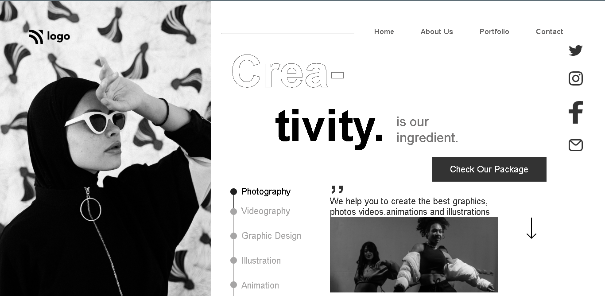

# Assignment-14

# Project [Deployed Link](https://deepakproject14.netlify.app)

- What I learned from this Project?
  - 
  - Learned how to make Dance Home landing page.
  - Learned how to give background image. 
  - Learned about layouts using grid and flex.
- Learned to use text-stroke-width to create outline text effect.
  - How to use different Google Fonts in webpage.
  - Learned how to make responsive web-design.
  
  

 
---

## Time taken to finish this project

- 4 hour to complete it.

---

## ScreenShot

